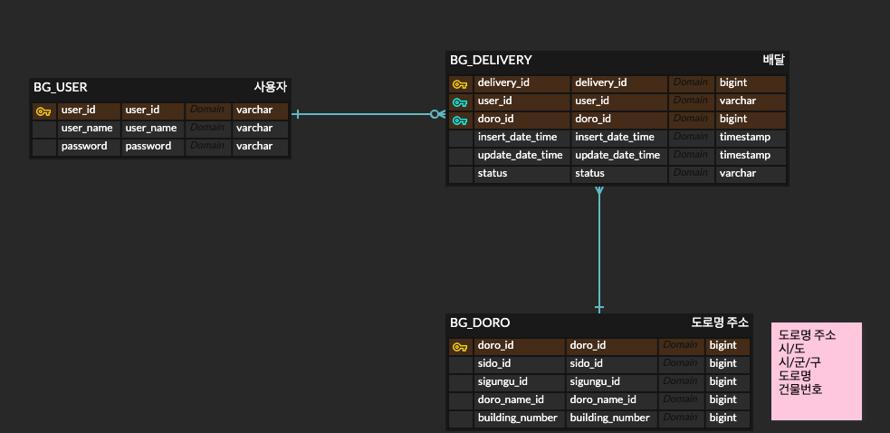

# Delivery Rest Api server

회원 가입, 로그인, 배달 조회, 배달 주문 수정 서비스를 위한 Back-End API 서버입니다.

## API
자세한 api 명세는 postman을 참고해주세요.   
[포스트맨](https://www.postman.com/restless-sunset-427704/workspace/delivery)

## 프로젝트 구조

## 데이터베이스 
### 기술 스택
h2를 사용하였으며, Embedded 모드로 사용하였습니다.   
h2-console 접속 정보는 application.yml에서 확인하실 수 있습니다.
```yaml
 datasource:
    url: jdbc:h2:mem:deliverydb
    username: sa
    password:
    driver-class-name: org.h2.Driver
```
스프링 부트가 뜰 때, 다음과 같은 user더미데이터를 생성하도록 하였습니다.
- user_id : admin
- user_name: admin
- password : a1234567!!!!!!!!!!!
```yaml
INSERT INTO BG_USER (USER_ID, USER_NAME, PASSWORD) VALUES ('testUser', 'testUser', 'a1234567!!!!!!!!!!!');
```
### ERD

- BG_USER
    - 사용자 정보를 담고있는 테이블입니다.
- BG_DELIVERY
    - 배달 정보를 담고있는 테이블입니다.
    - 도착지 정보를 도로명 주소로 표한한 테이블 (BG_DORO)의 id를 갖습니다.
    - 배달 상태는 status에 저장됩니다.
- BG_DORO
    - 도착지 정보를 도로명 주소로 표한한 테이블입니다.
    

## 로컬 실행방법
