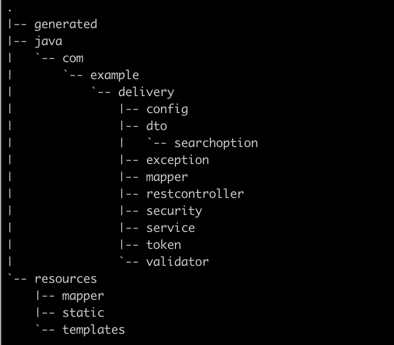

# Delivery Rest Api server

회원 가입, 로그인, 배달 조회, 배달 주문 수정 서비스를 위한 Back-End API 서버입니다.

## API
자세한 api 명세는 postman을 참고해주세요.   
[포스트맨](https://www.postman.com/restless-sunset-427704/workspace/delivery)

## 패키지 구조


## API 흐름
1. API 요청이 들어오면 filter에서 jwt 토큰 인증을 수행한다.
    - 로그인, 회원가입 요청은 제외
2. jwt token인증에 성공하면 restController로 요청이 들어간다.
3. validator에서 요청에 대한 검증을 수행한다.
4. 각 검증에 대한 예외코드는 ErrorCode enum클래스에서 관리되며, 예외에 대한 리소스는 message_{locale}.properties에서 관리한다.
5. 검증을 통과하면 service에서 비즈니스 로직을 수행하며, 이때 mapper를 통해 쿼리가 수행된다.

## 데이터베이스 
### 기술 스택
h2를 사용하였으며, Embedded 모드로 사용하였습니다.   
h2-console 접속 정보는 application.yml에서 확인하실 수 있습니다.
```yaml
 datasource:
    url: jdbc:h2:mem:deliverydb
    username: sa
    password:
    driver-class-name: org.h2.Driver
```
스프링 부트가 뜰 때, 다음과 같은 user더미데이터를 생성하도록 하였으니, 참고 부탁드립니다.
```yaml
INSERT INTO BG_USER (USER_ID, USER_NAME, PASSWORD) VALUES ('testUser1', 'testUser1', 'abcde123456789!!');
INSERT INTO BG_USER (USER_ID, USER_NAME, PASSWORD) VALUES ('testUser2', 'testUser2', 'abcde123456789@@');
INSERT INTO BG_USER (USER_ID, USER_NAME, PASSWORD) VALUES ('testUser3', 'testUser3', 'ABCDE123456789!!');
INSERT INTO BG_USER (USER_ID, USER_NAME, PASSWORD) VALUES ('testUser4', 'testUser4', 'ABCDE123456789@@');


INSERT INTO BG_DELIVERY (USER_ID, DORO_ID, INSERT_DATE_TIME, STATUS) VALUES ( 'testUser1', 1, CURRENT_TIMESTAMP, 'READY');
INSERT INTO BG_DELIVERY (USER_ID, DORO_ID, INSERT_DATE_TIME, STATUS) VALUES ( 'testUser1', 1, '2022-12-20', 'READY');
INSERT INTO BG_DELIVERY (USER_ID, DORO_ID, INSERT_DATE_TIME, STATUS) VALUES ( 'testUser1', 1, '2022-12-21', 'ING');
INSERT INTO BG_DELIVERY (USER_ID, DORO_ID, INSERT_DATE_TIME, STATUS) VALUES ( 'testUser1', 1, '2022-12-22', 'READY');
INSERT INTO BG_DELIVERY (USER_ID, DORO_ID, INSERT_DATE_TIME, STATUS) VALUES ( 'testUser1', 1, '2022-12-23', 'END');
INSERT INTO BG_DELIVERY (USER_ID, DORO_ID, INSERT_DATE_TIME, STATUS) VALUES ( 'testUser2', 1, CURRENT_TIMESTAMP, 'END');
INSERT INTO BG_DELIVERY (USER_ID, DORO_ID, INSERT_DATE_TIME, STATUS) VALUES ( 'testUser2', 1, '2022-12-20', 'READY');
INSERT INTO BG_DELIVERY (USER_ID, DORO_ID, INSERT_DATE_TIME, STATUS) VALUES ( 'testUser2', 1, '2022-12-21', 'READY');
INSERT INTO BG_DELIVERY (USER_ID, DORO_ID, INSERT_DATE_TIME, STATUS) VALUES ( 'testUser2', 1, '2022-12-22', 'END');
INSERT INTO BG_DELIVERY (USER_ID, DORO_ID, INSERT_DATE_TIME, STATUS) VALUES ( 'testUser2', 1, '2022-12-23', 'ING');


INSERT INTO BG_DORO (SIDO_ID, SIGUNGU_ID, DORO_NAME_ID, BUILDING_NUMBER) VALUES (1, 1, 1, 1);
INSERT INTO BG_DORO (SIDO_ID, SIGUNGU_ID, DORO_NAME_ID, BUILDING_NUMBER) VALUES (2, 2, 2, 2);
INSERT INTO BG_DORO (SIDO_ID, SIGUNGU_ID, DORO_NAME_ID, BUILDING_NUMBER) VALUES (3, 3, 3, 3);
```
### ERD

- BG_USER
    - 사용자 정보를 담고있는 테이블입니다.
- BG_DELIVERY
    - 배달 정보를 담고있는 테이블입니다.
    - 도착지 정보를 도로명 주소로 표한한 테이블 (BG_DORO)의 id를 갖습니다.
    - 배달 상태는 status에 저장됩니다.
- BG_DORO
    - 도착지 정보를 도로명 주소로 표한한 테이블입니다.
    

## 로컬 실행방법
로컬 실행방법은 아래와같이 2가지가 있습니다.
### 소스코드로 기동하기
1. 소스코드를 클론받는다.
```
git clone https://github.com/suna-ji/delivery.git
```
2. build 한다.
- gradlew가 있는 위치에서 진행해주세요.
```
./gradlew build
```
3. Intellij에서 run configuration을 Application으로 구성 후 run

   
### jar파일 실행하기
1. 소스코드를 클론받는다.
```
git clone https://github.com/suna-ji/delivery.git
```
2. jar파일을 실행한다.
- package폴더에 delivery.jar파일을 넣어두었습니다.
```yaml
java -jar delivery.jar
```